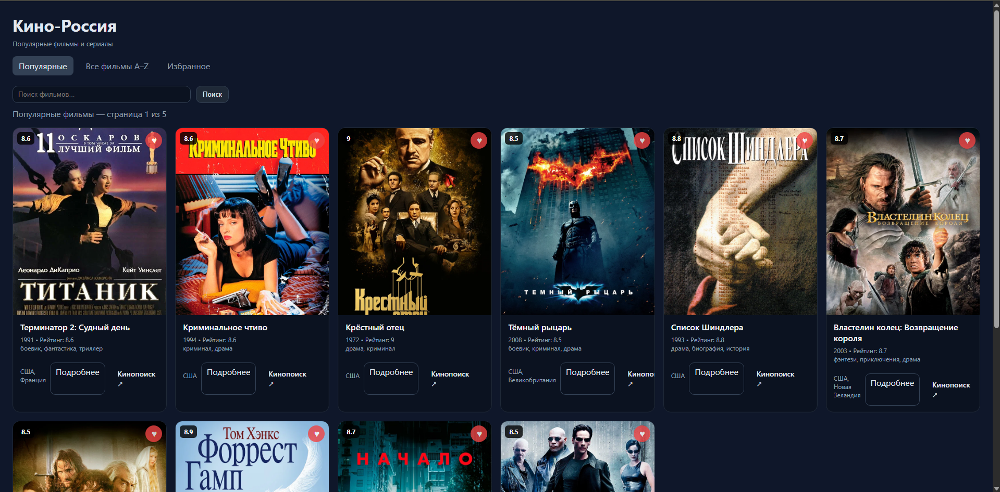
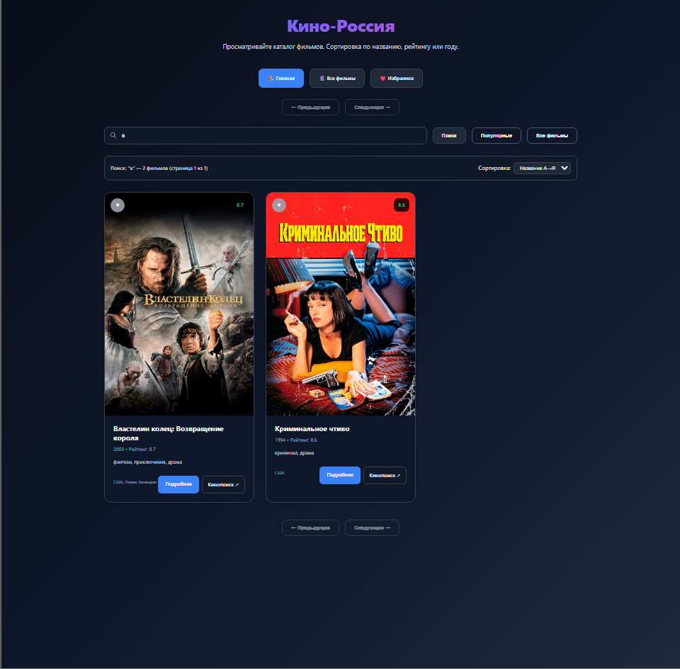
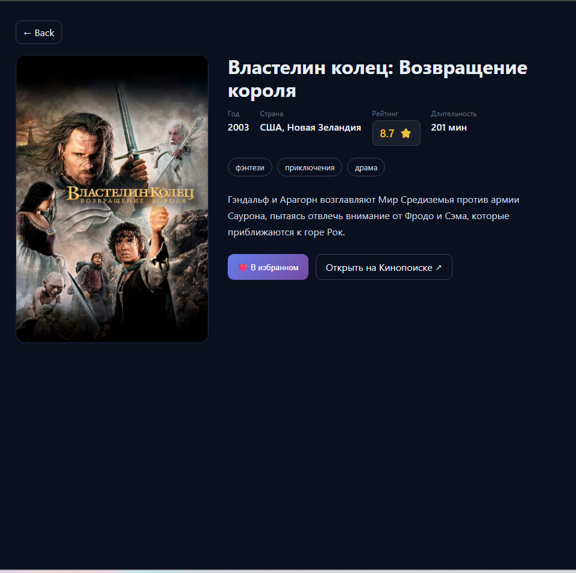
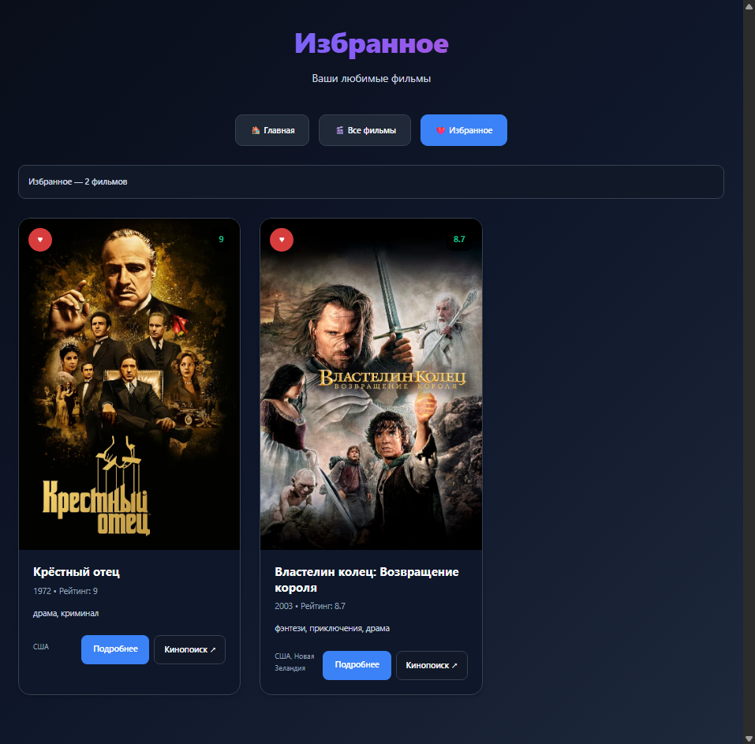
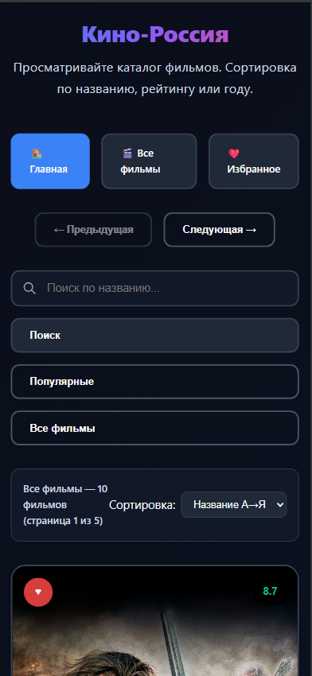

# Кино-Россия 🎬

Современное веб-приложение для просмотра каталога фильмов с функционалом избранного.

## ✨ Возможности

- 🎭 **Каталог фильмов** - просмотр популярных фильмов с пагинацией
- 🔍 **Поиск** - поиск фильмов по названию
- ❤️ **Избранное** - добавление фильмов в избранное (гостевой режим)
- 📱 **Адаптивный дизайн** - работает на всех устройствах
- 🌙 **Тёмная тема** - современный UI с тёмной темой
- 🇷🇺 **Русский интерфейс** - полностью на русском языке

## 🚀 Быстрый старт

### Требования

- PHP 8.1+
- Composer
- SQLite (встроенная база данных)
- Kinopoisk API ключ

### Установка

1. **Клонируйте репозиторий:**
```bash
git clone <repository-url>
cd kino-integrator
```

2. **Установите зависимости:**
```bash
composer install
```

3. **Настройте окружение:**
```bash
cp .env.example .env
```

4. **Настройте базу данных:**
```bash
# SQLite уже настроена по умолчанию
# Для MySQL/PostgreSQL измените настройки в .env:
# DB_CONNECTION=mysql
# DB_HOST=127.0.0.1
# DB_PORT=3306
# DB_DATABASE=kino_integrator
# DB_USERNAME=root
# DB_PASSWORD=
```

5. **Добавьте API ключ в `.env`:**
```env
KINOPOISK_API_KEY=your_api_key_here
```

6. **Запустите миграции:**
```bash
php artisan migrate
```

7. **Запустите приложение:**
```bash
php artisan serve
```

8. **Откройте в браузере:**
```
http://localhost:8000
```

### Получение API ключа

1. Перейдите на [Kinopoisk Unofficial API](https://kinopoiskapiunofficial.tech/)
2. Зарегистрируйтесь и получите бесплатный API ключ
3. Добавьте ключ в файл `.env`:
```env
KINOPOISK_API_KEY=ваш_ключ_здесь
```

## 📁 Структура проекта

```
app/
├── Http/Controllers/
│   ├── MovieController.php      # API для фильмов
│   └── FavoritesController.php  # API для избранного
resources/views/
├── movies.blade.php            # Главная страница
├── favorites.blade.php         # Страница избранного
└── movie.blade.php            # Страница фильма
routes/
├── api.php                     # API маршруты
└── web.php                     # Web маршруты
database/
├── migrations/
│   └── create_favorites_table.php
└── database.sqlite            # База данных SQLite
```

## 🔌 API Endpoints

### Фильмы
- `GET /api/movies/popular` - Популярные фильмы
- `GET /api/movies/search?q=query` - Поиск фильмов
- `GET /api/movies/list` - Список всех фильмов
- `GET /api/movies/{id}` - Детали фильма

### Избранное
- `GET /api/favorites` - Получить избранное
- `POST /api/favorites/{movieId}` - Добавить в избранное
- `DELETE /api/favorites/{movieId}` - Удалить из избранного
- `GET /api/favorites/check/{movieId}` - Проверить статус

## 🎯 Основные страницы

- `/` - Главная страница (популярные фильмы)
- `/movies` - Каталог всех фильмов
- `/favorites` - Избранные фильмы
- `/movie/{id}` - Страница фильма

## 🛠 Технологии

- **Backend:** Laravel 11, PHP 8.1+
- **Frontend:** Vanilla JavaScript, CSS3
- **Storage:** SQLite (избранное)
- **API:** Kinopoisk API
- **Design:** Современный UI с тёмной темой

## 📱 Особенности

### Пагинация
- 10 фильмов на странице
- Навигация стрелками
- Показ текущей страницы

### Избранное
- Гостевой режим (без регистрации)
- Хранение в SQLite
- Автоматическое создание guest_id
- Синхронизация между страницами

### Поиск
- Поиск по названию
- Интеграция с пагинацией
- Обработка ошибок

### Кэширование
- Кэширование ответов API для оптимизации
- Автоматическое обновление кэша

## 🔧 Настройка

### База данных
По умолчанию используется SQLite (файл `database/database.sqlite`).
Для использования MySQL или PostgreSQL:

1. Измените настройки в `.env`:
```env
DB_CONNECTION=mysql
DB_HOST=127.0.0.1
DB_PORT=3306
DB_DATABASE=kino_integrator
DB_USERNAME=root
DB_PASSWORD=
```

2. Создайте базу данных:
```sql
CREATE DATABASE kino_integrator;
```

3. Запустите миграции:
```bash
php artisan migrate
```

### API ключ
Получите API ключ на [Kinopoisk API](https://kinopoiskapiunofficial.tech/) и добавьте в `.env`:
```env
KINOPOISK_API_KEY=your_api_key_here
```

## 🎨 Интерфейс

- **Адаптивный дизайн** — работает на всех устройствах
- **Тёмная тема** — современный внешний вид
- **Интуитивная навигация** — простое управление
- **Быстрая загрузка** — оптимизированная производительность
- **Визуальная обратная связь** — индикаторы загрузки и ошибок

## 📸 Скриншоты

### Главная страница

*Отображение популярных фильмов с пагинацией*

### Поиск фильмов

*Поиск по названию с результатами*

### Страница фильма

*Полная информация о фильме: постер, рейтинг, жанры, описание*

### Избранное

*Персональная коллекция избранных фильмов*

### Адаптивный дизайн

*Оптимизированный интерфейс для мобильных устройств*

## 🔒 Безопасность

- **Защита от SQL инъекций** — использование подготовленных запросов Laravel
- **Валидация входных данных** — проверка всех пользовательских данных
- **Безопасное хранение API ключей** — использование .env файлов
- **Обработка ошибок** — корректная обработка 404, 500 и сетевых ошибок

## ⚡ Производительность

- **Кэширование API ответов** — уменьшение количества запросов к внешнему API
- **Оптимизация запросов к БД** — эффективные запросы с индексами
- **Ленивая загрузка изображений** — оптимизация загрузки постеров
- **Минификация CSS/JS** — уменьшение размера файлов

## 🐳 Docker (рекомендуется)

Для развертывания через Docker:

1. **Клонируйте репозиторий:**
```bash
git clone <repository-url>
cd kino-integrator
```

2. **Добавьте API ключ в `.env`:**
```env
KINOPOISK_API_KEY=your_api_key_here
```

3. **Запустите через Docker:**
```bash
docker-compose up -d
```

4. **Запустите миграции:**
```bash
docker-compose exec app php artisan migrate
```

5. **Откройте в браузере:**
```
http://localhost:8000
```

### Docker команды

```bash
# Запуск
docker-compose up -d

# Остановка
docker-compose down

# Просмотр логов
docker-compose logs -f

# Выполнение команд в контейнере
docker-compose exec app php artisan migrate
docker-compose exec app php artisan cache:clear
```

## 🤝 Вклад в проект

1. Fork репозиторий
2. Создайте feature branch
3. Commit изменения
4. Push в branch
5. Создайте Pull Request

## 📄 Лицензия

MIT License

## 👨‍💻 Автор

Проект кино-интегратора

## 🙏 Благодарности

- [Kinopoisk Unofficial API](https://kinopoiskapiunofficial.tech/) за предоставление данных о фильмах
- [Laravel](https://laravel.com/) за отличный PHP фреймворк